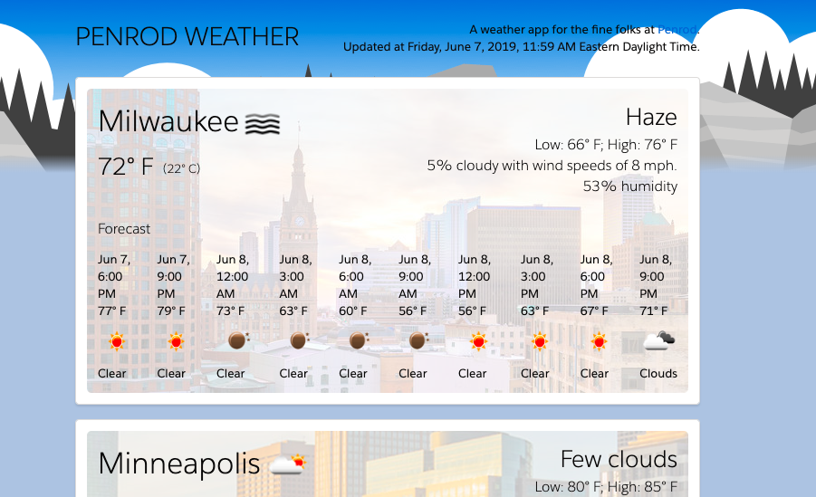

# Weather Penrod

### Background

[Weather Penrod Live](http://www.davidanderson.nyc/weather-penrod)

Weather Penrod displays the weather for the cities in which Penrod has offices: Milwaukee, Minneapolis, Chicago, and Dallas. 

### Technologies and Architecture

Weather Penrod makes use of the following languages:

- `JavaScript`
- `HTML5`
- `CSS3`

Weather Penrod also uses the following libraries: 

- `React`
- `Luxon`

CSS styling is from [Lightning Design System](https://www.lightningdesignsystem.com/). Weather data is from [OpenWeatherMap](https://openweathermap.org). 

### HTTPS Issues

Because OpenWeatherMap only accepts HTTP requests, scripts on the live page will may not run. Please check your browser and allow it to run all scripts for this page. 

### Image credits

Milwaukee image taken from WUWM 89.7, ["5 Developments Coming To Downtown Milwaukee."](https://www.wuwm.com/post/5-developments-coming-downtown-milwaukee#stream/0) Minneapolis image taken from Downtown Resource Group, ["The 10 Best Neighborhoods in Minneapolis."](https://drgmpls.com/the-10-best-neighborhoods-in-minneapolis/) Chicago image taken from Bozzuto, ["Chicago Apartments."](https://www.bozzuto.com/apartments-for-rent/chicago/) Dallas image taken from Community Impact Newspaper, ["Dallas added more people in 2016-17 than all but two U.S. cities, according to Census population estimates."](https://communityimpact.com/dallas-fort-worth/data-reference/2018/05/23/dallas-added-more-people-in-2016-17-than-all-but-two-u-s-cities-according-to-census-population-estimates/) Penrod favicon taken from [Penrod's LinkedIn page.](https://www.linkedin.com/company/penrodhq)